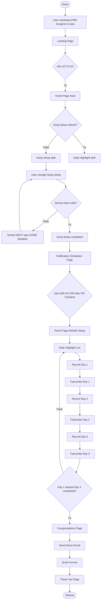
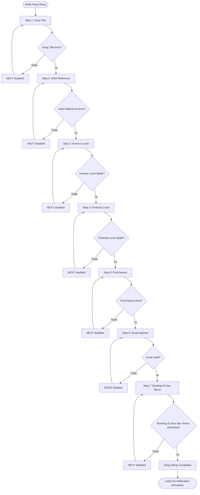
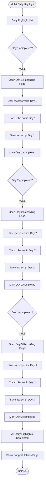
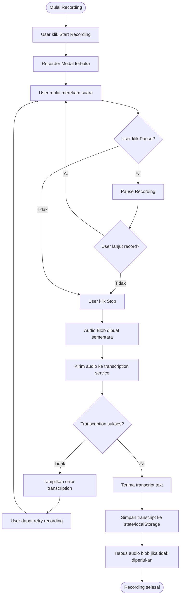
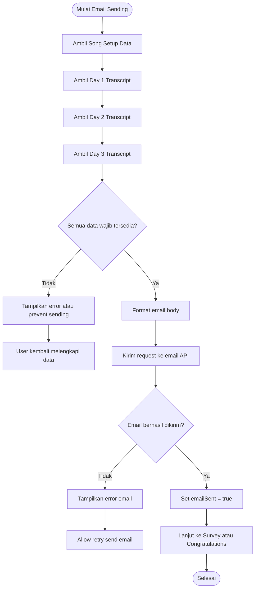

# PRD.md — SongZoo Cruise PWA Proof of Concept

## 1. Product Overview

**SongZoo Cruise PWA Proof of Concept** adalah aplikasi mobile-first berbasis Progressive Web App yang digunakan untuk mendemonstrasikan pengalaman membuat personalized souvenir song dari pengalaman cruise pengguna.

Aplikasi ini dibuat sebagai **proof of concept**, bukan aplikasi production penuh. Tujuannya adalah membuat aplikasi terlihat seperti produk asli ketika dipresentasikan kepada prospek, tetapi secara teknis dapat dibuat dengan cara paling sederhana, cepat, dan hemat biaya.

User akan mengisi preferensi lagu, merekam highlight harian selama cruise, lalu sistem mengubah rekaman suara menjadi transkrip teks. Pada akhir proses, data utama dikirim melalui email demo kepada client/admin.

Core concept aplikasi:

```text
Turn your cruise into your song.
```

Artinya, pengalaman user selama cruise akan dikumpulkan dan dijadikan bahan untuk membuat lagu kenangan personal.

---

## 2. Background

SongZoo ingin membuat pengalaman cruise menjadi lebih personal dan memorable. Salah satu cara yang ditawarkan adalah dengan memberikan souvenir berbentuk lagu personal kepada tamu cruise.

Masalahnya, untuk menjual ide ini kepada partner atau prospek, SongZoo membutuhkan prototype yang terlihat nyata dan mudah dicoba.

Prototype ini tidak perlu memiliki seluruh fitur production seperti database, login, validasi booking asli, push notification sungguhan, atau AI music generation. Yang dibutuhkan adalah aplikasi demo yang:

- terlihat seperti aplikasi asli,
- mengikuti desain pada PDF brief,
- dapat menjalankan alur utama dari awal sampai akhir,
- dapat merekam suara,
- dapat menghasilkan transkrip,
- dan dapat mengirim email demo berisi data user.

---

## 3. Product Goals

Tujuan aplikasi:

1. Menampilkan pengalaman interaktif “turn your cruise into your song”.
2. Membantu prospek memahami value SongZoo melalui demo langsung.
3. Mengumpulkan preferensi lagu dari user.
4. Mengumpulkan highlight harian user dalam bentuk transkrip.
5. Mengirim data demo melalui email kepada client/admin.
6. Mensimulasikan flow aplikasi asli tanpa membangun sistem production penuh.
7. Membuat PWA yang ringan, cepat, dan mobile-first.
8. Menyediakan quick survey sebagai bagian dari pengalaman akhir user.

---

## 4. User Persona

### 4.1 Primary User

**Cruise Guest / Passenger**

User yang sedang atau seolah-olah sedang mengikuti cruise dan ingin membuat lagu kenangan dari pengalaman perjalanannya.

Kebutuhan user:

- Mengisi data dengan cepat.
- Tidak ingin proses rumit.
- Ingin pengalaman yang fun dan personal.
- Ingin tahu bahwa lagu akan dikirim melalui email.
- Ingin merekam cerita harian dengan mudah.

---

### 4.2 Secondary User

**SongZoo / Demo Owner / Sales Team**

Pihak yang menggunakan prototype ini untuk mempresentasikan konsep kepada prospek atau partner cruise.

Kebutuhan user:

- Demo harus terlihat profesional.
- Flow harus cepat dijalankan dalam meeting.
- Tidak perlu setup backend rumit.
- Data hasil demo cukup dikirim via email.
- Aplikasi harus mengikuti desain PDF.

---

### 4.3 Prospect / Cruise Partner

Pihak yang melihat demo dan menilai apakah konsep ini menarik untuk digunakan dalam cruise mereka.

Kebutuhan user:

- Melihat pengalaman user secara jelas.
- Memahami value dari personalized song.
- Merasa aplikasi ini mudah digunakan oleh tamu cruise.
- Melihat bahwa flow bisa diintegrasikan ke pengalaman cruise.

---

## 5. Scope

### 5.1 In Scope

Fitur yang perlu dibuat dalam POC:

1. Landing Page.
2. Home Page.
3. Song Setup multi-step form.
4. Validasi input pada setiap step.
5. Tombol NEXT/DONE aktif hanya jika input valid.
6. Simulasi notification permission.
7. Home Page after Song Setup completed.
8. Daily Highlight list page.
9. Recording page untuk Day 1, Day 2, dan Day 3.
10. Voice recorder popup/modal.
11. Transkripsi suara menjadi teks.
12. Penyimpanan data sementara menggunakan state/localStorage.
13. Congratulations Page.
14. Email otomatis berisi data Song Setup dan transkrip Day 1–3.
15. Quick Survey rating page.
16. Quick Survey amenities page.
17. Quick Survey suggestion page.
18. Thank You Page.
19. Mobile-first UI sesuai desain PDF.
20. PWA-ready behavior secara basic.

---

### 5.2 Out of Scope

Fitur yang tidak perlu dibuat dalam POC:

1. Database permanen.
2. Login/register.
3. Authentication.
4. User account.
5. Real push notification.
6. Real notification permission setup.
7. AI music generation.
8. Real song creation.
9. Upload audio permanen.
10. Penyimpanan file audio.
11. Validasi Booking ID ke sistem cruise asli.
12. Dashboard admin.
13. Payment.
14. Analytics production.
15. Survey result storage.
16. Multi-tenant cruise management.
17. CMS.
18. Admin panel.
19. Email ke user final berisi lagu asli.
20. Backend kompleks.

---

## 6. Main User Flow

User flow utama:

1. User membuka aplikasi.
2. User melihat Landing Page.
3. User klik `LET’S GO!`.
4. User masuk ke Home Page.
5. User klik Song Setup.
6. User mengisi Song Setup step-by-step.
7. User menyelesaikan Song Setup.
8. User melihat halaman notification simulation.
9. User memilih `ALLOW` atau `NO THANKS`.
10. User kembali ke Home Page.
11. Song Setup berubah menjadi `DONE`.
12. Daily Highlight menjadi aktif.
13. User masuk ke Daily Highlight.
14. User record Day 1.
15. Sistem transcribe Day 1.
16. User otomatis masuk Day 2.
17. User record Day 2.
18. Sistem transcribe Day 2.
19. User otomatis masuk Day 3.
20. User record Day 3.
21. Sistem transcribe Day 3.
22. User melihat Congratulations Page.
23. Sistem mengirim demo email.
24. User masuk ke Quick Survey.
25. User mengisi rating survey.
26. User memilih amenities.
27. User mengisi suggestion.
28. User melihat Thank You Page.
29. Flow selesai.

---

## 7. Flowchart Alur Sistem Utama



---

## 8. Flowchart UI / User Flow

```mermaid
flowchart TD
    A([Mulai]) --> B[Landing Page]
    B --> C[Klik LET'S GO]
    C --> D[Home Page]

    D --> E[Klik Song Setup]
    E --> F[Input Song Title]
    F --> G[Input Artist Reference]
    G --> H[Select Humour Level]
    H --> I[Select Profanity Level]
    I --> J[Input First Names]
    J --> K[Input Email Address]
    K --> L[Input Booking ID dan Accept Terms]

    L --> M[Well Done Notification Page]
    M --> N[Klik ALLOW atau NO THANKS]
    N --> O[Home Page Updated]

    O --> P[Klik Daily Highlight]
    P --> Q[Daily Highlight List]
    Q --> R[Klik Day 1]
    R --> S[Record Day 1]
    S --> T[Auto Move to Day 2]
    T --> U[Record Day 2]
    U --> V[Auto Move to Day 3]
    V --> W[Record Day 3]
    W --> X[All Days Completed]

    X --> Y[Congratulations Page]
    Y --> Z[Klik LET'S GO]
    Z --> AA[Survey Rating Page]
    AA --> AB[Survey Amenities Page]
    AB --> AC[Survey Suggestion Page]
    AC --> AD[Thank You Page]
    AD --> AE([Selesai])
```



---

## 9. Flowchart Song Setup Logic



---

## 10. Flowchart Daily Highlight Logic



---

## 11. Flowchart Transcription Logic



---

## 12. Flowchart Email Sending Logic



---

## 13. Input Parameters

### 13.1 Song Setup Inputs

| Field | Type | Required | Description | Example |
|---|---|---|---|---|
| songTitle | string | Yes | Judul souvenir song | Our Cruise to Spain |
| artistReference | string | Yes | Artis/grup referensi untuk gaya lagu | Elvis Presley |
| humourLevel | enum | Yes | Level kelucuan lirik | Very funny |
| profanityLevel | enum | Yes | Level profanity dalam lagu | No profanities |
| firstNames | string | Yes | Nama depan orang yang ingin disebut di lagu | John, Sally, Mary |
| emailAddress | email | Yes | Email user untuk pengiriman lagu | johnsmith@gmail.com |
| bookingId | string | Yes | Booking ID cruise user | X2390GH |
| termsAccepted | boolean | Yes | Persetujuan terms | true |

---

### 13.2 Daily Highlight Inputs

| Field | Type | Required | Description | Example |
|---|---|---|---|---|
| day1Audio | audio blob | Temporary | Rekaman suara Day 1 | audio/webm |
| day1Transcript | string | Yes | Hasil transkripsi Day 1 | Today we visited Cozumel... |
| day2Audio | audio blob | Temporary | Rekaman suara Day 2 | audio/webm |
| day2Transcript | string | Yes | Hasil transkripsi Day 2 | We enjoyed the pool and dinner... |
| day3Audio | audio blob | Temporary | Rekaman suara Day 3 | audio/webm |
| day3Transcript | string | Yes | Hasil transkripsi Day 3 | The final day was amazing... |

Important:

```text
Audio file tidak perlu disimpan permanen.
Yang perlu disimpan hanya transcript text.
```

---

### 13.3 Survey Inputs

| Field | Type | Required | Description | Example |
|---|---|---|---|---|
| recommendationScore | number | No | Rating rekomendasi cruise | 8 |
| cleanlinessScore | number | No | Rating kebersihan kapal | 9 |
| staffFriendlinessScore | number | No | Rating keramahan staff | 10 |
| amenitiesUsed | string[] | No | Fasilitas yang digunakan | Spa, Pool |
| suggestion | string | No | Saran user | More live music events |

Important:

```text
Survey results tidak perlu disimpan untuk prototype.
```

---

## 14. Output Results

### 14.1 Main Output

Output utama dari aplikasi adalah **email demo** yang berisi:

| Field | Source | Included in Email |
|---|---|---|
| Song title | Song Setup | Yes |
| Musical artist | Song Setup | Yes |
| Humour level | Song Setup | Yes |
| Profanities | Song Setup | Yes |
| First names | Song Setup | Yes |
| Email address | Song Setup | Yes |
| Booking ID | Song Setup | Yes |
| Day 1 transcript | Daily Highlight | Yes |
| Day 2 transcript | Daily Highlight | Yes |
| Day 3 transcript | Daily Highlight | Yes |
| Survey rating | Survey | No |
| Survey amenities | Survey | No |
| Survey suggestion | Survey | No |

---

### 14.2 Email Output Example

```text
Subject: Cruise Demo

Song title: Our Cruise to Spain
Musical artist: Elvis Presley
Humour level: Very funny
Profanities: No profanities
First names: John, Sally, Mary
Email address: johnsmith@gmail.com
Booking ID: X2390GH

Day 1: This is the transcribed text from day 1 voice recording.

Day 2: This is the transcribed text from day 2 voice recording.

Day 3: This is the transcribed text from day 3 voice recording.
```

---

## 15. Page List

| No | Page | Route Suggestion | Description |
|---|---|---|---|
| 1 | Landing Page | `/` | Opening page with main CTA |
| 2 | Home Page | `/home` | Main menu with Song Setup, Daily Highlight, Quick Survey |
| 3 | Song Setup Step 1 | `/song-setup/title` | Input song title |
| 4 | Song Setup Step 2 | `/song-setup/artist` | Input artist reference |
| 5 | Song Setup Step 3 | `/song-setup/humour` | Select humour level |
| 6 | Song Setup Step 4 | `/song-setup/profanity` | Select profanity level |
| 7 | Song Setup Step 5 | `/song-setup/names` | Input first names |
| 8 | Song Setup Step 6 | `/song-setup/email` | Input email address |
| 9 | Song Setup Step 7 | `/song-setup/booking` | Input booking ID and accept terms |
| 10 | Notification Simulation | `/notifications` | Simulated notification permission |
| 11 | Daily Highlight List | `/daily-highlight` | List Day 1, Day 2, Day 3 |
| 12 | Daily Highlight Day 1 | `/daily-highlight/day-1` | Record Day 1 |
| 13 | Daily Highlight Day 2 | `/daily-highlight/day-2` | Record Day 2 |
| 14 | Daily Highlight Day 3 | `/daily-highlight/day-3` | Record Day 3 |
| 15 | Congratulations Page | `/completed` | Song submitted message |
| 16 | Survey Rating | `/survey/rating` | Rating sliders |
| 17 | Survey Amenities | `/survey/amenities` | Multi-select amenities |
| 18 | Survey Suggestion | `/survey/suggestion` | Textarea suggestion |
| 19 | Thank You Page | `/thank-you` | Final thank you message |

---

## 16. Detailed Page Requirements

### 16.1 Landing Page

#### Purpose

Landing Page berfungsi sebagai halaman pembuka untuk menarik perhatian user dan menjelaskan value utama aplikasi.

#### Content

```text
ICON OF THE SEAS

TURN YOUR
CRUISE
INTO YOUR
SONG

VALUED AT $150
(yours for free!)

LET’S GO!

Powered by SongZoo
```

#### UI Requirements

- Mobile-first layout.
- Header cruise branding di bagian atas.
- Text besar dan bold.
- CTA button biru.
- SongZoo branding di bagian bawah.
- Background putih pada area app.

#### Behavior

```text
User klik LET’S GO
↓
Navigate ke Home Page
```

#### Functional Requirement

- Button `LET’S GO!` harus selalu aktif.
- Tidak ada form validation pada halaman ini.

---

### 16.2 Home Page — Initial State

#### Purpose

Home Page berfungsi sebagai menu utama aplikasi.

#### Content

```text
SONG SETUP
(Takes only 2 minutes – one time)

DAILY HIGHLIGHT
(Takes only 1 minute per day)

QUICK SURVEY
(Takes only 5 minutes – end of cruise)

We’ll create your fully personalized song and email it to you 24-48 hours after your cruise – all for free!
```

#### Initial State

| Menu | State | Style | Clickable |
|---|---|---|---|
| Song Setup | Active | Blue | Yes |
| Daily Highlight | Disabled | Grey | No |
| Quick Survey | Disabled | Grey | No |

#### Behavior

```text
If Song Setup not completed:
  Song Setup button active
  Daily Highlight disabled
  Quick Survey disabled
```

---

### 16.3 Song Setup Step 1 — Song Title

#### Purpose

Mengambil judul lagu yang ingin dibuat user.

#### Question

```text
What shall we call your souvenir song?
```

#### Helper Text

```text
For example "Bahamas here we come!"

You can change your song title any time during your cruise if you wish.
```

#### Input

| Field | Type | Required |
|---|---|---|
| songTitle | text | Yes |

#### Buttons

```text
< BACK
NEXT >
```

#### Validation

```text
If songTitle.trim() === "":
  NEXT disabled

Else:
  NEXT enabled
```

#### Example

```json
{
  "songTitle": "Our Cruise to Spain"
}
```

---

### 16.4 Song Setup Step 2 — Artist Reference

#### Purpose

Mengambil referensi gaya musik dari artis/grup yang dipilih user.

#### Question

```text
Which artist or group would you like your song to sound similar to?
```

#### Helper Text

```text
We’ll do our very best to make it sound as similar as we can.

You can change your chosen artist any time during your cruise if you wish.
```

#### Input

| Field | Type | Required |
|---|---|---|
| artistReference | text | Yes |

#### Validation

```text
If artistReference.trim() === "":
  NEXT disabled

Else:
  NEXT enabled
```

#### Example

```json
{
  "artistReference": "Elvis Presley"
}
```

---

### 16.5 Song Setup Step 3 — Humour Level

#### Purpose

Mengambil preferensi seberapa lucu lirik lagu yang diinginkan user.

#### Question

```text
How funny do you want your song lyrics to be?
```

#### Options

| Value | Label | Display |
|---|---|---|
| not_funny | Not funny | 😐 |
| quite_funny | Quite funny | 😀 |
| very_funny | Very funny | 😂 |

#### Input

| Field | Type | Required |
|---|---|---|
| humourLevel | enum | Yes |

#### Validation

```text
If humourLevel is null:
  NEXT disabled

Else:
  NEXT enabled
```

#### UI Behavior

- Option yang dipilih harus highlighted blue.
- Option yang tidak dipilih tetap white/grey.
- User hanya bisa memilih satu option.

#### Example

```json
{
  "humourLevel": "Very funny"
}
```

---

### 16.6 Song Setup Step 4 — Profanity Level

#### Purpose

Mengambil preferensi apakah lagu boleh mengandung kata kasar.

#### Question

```text
Would you like your song to include any profanities?
```

#### Helper Text

```text
The worst profanities used are the S-bomb and the F-bomb.

You can change your profanities level any time during your cruise if you wish.
```

#### Options

| Value | Label | Display |
|---|---|---|
| none | None | X |
| some | Some | ! |
| lots | Lots | !! |

#### Input

| Field | Type | Required |
|---|---|---|
| profanityLevel | enum | Yes |

#### Validation

```text
If profanityLevel is null:
  NEXT disabled

Else:
  NEXT enabled
```

#### Example

```json
{
  "profanityLevel": "No profanities"
}
```

---

### 16.7 Song Setup Step 5 — First Names

#### Purpose

Mengambil nama-nama orang yang ingin disebut di lirik lagu.

#### Question

```text
What is your first name?
And the first name of others in your group?
```

#### Helper Text

```text
Type in the first name of any people you want mentioned in your song lyrics
(first names only, separated by a comma).

You can change these names any time during your cruise if you wish.
```

#### Input

| Field | Type | Required |
|---|---|---|
| firstNames | text | Yes |

#### Validation

```text
If firstNames.trim() === "":
  NEXT disabled

Else:
  NEXT enabled
```

#### Example

```json
{
  "firstNames": "John, Sally, Mary"
}
```

---

### 16.8 Song Setup Step 6 — Email Address

#### Purpose

Mengambil email user untuk simulasi pengiriman lagu.

#### Question

```text
What is your email address?
```

#### Helper Text

```text
This is the email address we will send your finished song to
(24-48 hours after your cruise).

You can change this email address any time during your cruise if you wish.
```

#### Input

| Field | Type | Required |
|---|---|---|
| emailAddress | email | Yes |

#### Validation

```text
If emailAddress.trim() === "":
  DONE disabled

If emailAddress is not valid email:
  DONE disabled

Else:
  DONE enabled
```

#### Example Regex

```text
^[^\s@]+@[^\s@]+\.[^\s@]+$
```

#### Example

```json
{
  "emailAddress": "johnsmith@gmail.com"
}
```

---

### 16.9 Song Setup Step 7 — Booking ID and Terms

#### Purpose

Mengambil Booking ID user dan simulasi persetujuan Terms of Service.

#### Question

```text
What is your booking ID?
```

#### Helper Text

```text
This is used to validate you are a registered guest on this cruise.
```

#### Input

| Field | Type | Required |
|---|---|---|
| bookingId | text | Yes |
| termsAccepted | checkbox | Yes |

#### Checkbox Label

```text
I agree to the SongZoo Terms of Service
```

#### Validation

```text
If bookingId.trim() === "":
  NEXT disabled

If termsAccepted === false:
  NEXT disabled

If bookingId filled and termsAccepted === true:
  NEXT enabled
```

#### Example

```json
{
  "bookingId": "X2390GH",
  "termsAccepted": true
}
```

#### Completion Logic

```text
Set songSetup.isCompleted = true
Navigate to Notification Simulation Page
```

---

### 16.10 Notification Simulation Page

#### Purpose

Mensimulasikan permission notification tanpa menggunakan push notification sungguhan.

#### Content

```text
WELL DONE!

You have successfully completed your song setup.

Once a day, simply record a 30-second highlight of your day.

We can send you a daily reminder
(recommended so you don’t forget).

If you would like to turn the daily reminder on,
simply press the "ALLOW" button below.
```

#### Buttons

```text
NO THANKS
ALLOW
```

#### Important Prototype Rule

```text
Real push notification tidak perlu dibuat.
Klik ALLOW hanya mensimulasikan behavior notification.
```

#### Behavior

```text
If user clicks ALLOW:
  notificationSimulated = true
  Navigate to Home Page After Setup

If user clicks NO THANKS:
  notificationSimulated = false
  Navigate to Home Page After Setup
```

---

### 16.11 Home Page — After Song Setup

#### Purpose

Menampilkan perubahan status setelah Song Setup selesai.

#### Updated State

| Menu | State | Style | Clickable |
|---|---|---|---|
| Song Setup | DONE | Blue | Yes, for edit |
| Daily Highlight | Active | Blue | Yes |
| Quick Survey | Disabled | Grey | No |

#### Content

```text
SONG SETUP
DONE! (Tap here to edit)

DAILY HIGHLIGHT
(Takes only 1 minute per day)

QUICK SURVEY
(Takes only 5 minutes – end of cruise)
```

#### Behavior

```text
If user taps Song Setup:
  Navigate to Song Setup for edit

If user taps Daily Highlight:
  Navigate to Daily Highlight List

If user taps Quick Survey before Daily Highlight complete:
  Do nothing or keep disabled
```

---

### 16.12 Daily Highlight List Page

#### Purpose

Menampilkan daftar highlight yang harus direkam user.

#### Content

```text
DAILY HIGHLIGHT

DAY 1
DAY 2
DAY 3
```

#### Initial State

| Day | State | Clickable |
|---|---|---|
| Day 1 | Active | Yes |
| Day 2 | Disabled | No |
| Day 3 | Disabled | No |

#### Completed State

| Day | State | Display |
|---|---|---|
| Day 1 | Completed | DAY 1 ✓ |
| Day 2 | Completed | DAY 2 ✓ |
| Day 3 | Completed | DAY 3 ✓ |

#### Behavior

```text
If no day completed:
  Day 1 active

If Day 1 completed and Day 2 not completed:
  Day 2 active

If Day 2 completed and Day 3 not completed:
  Day 3 active

If all completed:
  Show all days with checkmark
  Navigate to Congratulations Page
```

---

### 16.13 Daily Highlight Recording Page

#### Purpose

Merekam highlight harian user dan mengubahnya menjadi teks.

#### Dynamic Header

```text
DAY 1
```

or

```text
DAY 2
```

or

```text
DAY 3
```

#### Instruction Text

```text
Time to record your highlight!

- Speak clearly in a normal tone.
- Speak in any language (english gets best results).
  The language you speak will be the language used for your song lyrics.
- Speak about what made today great.
- We recommend about 30-60 seconds.
- No human will hear what you record.
- When you’re ready, simply tap the record button below to start.
```

#### CTA

```text
Start recording
```

#### UI Requirements

- Large red circular microphone button.
- Text label below button.
- Home icon to return to Daily Highlight list.
- Cruise header branding.
- SongZoo footer branding.

#### Behavior

```text
User taps Start Recording
↓
Open Recorder Modal
```

---

### 16.14 Recorder Modal

#### Purpose

Memberikan UI untuk merekam suara user.

#### Controls

| Control | Function |
|---|---|
| Record | Mulai merekam |
| Pause | Pause recording |
| Resume | Lanjutkan recording |
| Stop | Selesai recording |
| Play | Preview hasil recording |
| Save/Done | Kirim audio untuk transkripsi |

#### States

| State | Description |
|---|---|
| idle | Belum mulai record |
| recording | Sedang merekam |
| paused | Recording dipause |
| stopped | Recording selesai |
| transcribing | Audio sedang ditranskripsi |
| completed | Transcript berhasil dibuat |
| error | Transcription gagal |

#### Behavior

```text
Record clicked:
  Start MediaRecorder

Pause clicked:
  Pause MediaRecorder

Resume clicked:
  Resume MediaRecorder

Stop clicked:
  Stop MediaRecorder
  Create audio blob

Done clicked:
  Send audio blob to transcription service
```

---

### 16.15 Congratulations Page

#### Purpose

Memberitahu user bahwa personalized song sudah completed dan submitted ke AI studio.

#### Content

```text
CONGRATULATIONS!

Your personalized souvenir song is successfully completed
and submitted to our AI studio for lyric and music creation.

When finished, your song will be emailed to you within 24-48 hours
and is yours to keep as a "forever" memory!

Only one last step needed:
take 5-10 minutes to tell us what you think about your time with us.

We look forward to hearing what you thought!
```

#### CTA

```text
LET’S GO!
```

#### Behavior

```text
On page load:
  If emailSent === false:
    Send demo email

If email success:
  emailSent = true

User clicks LET’S GO:
  Navigate to Survey Rating Page
```

---

### 16.16 Survey Rating Page

#### Purpose

Mengumpulkan rating umum dari user tentang cruise.

#### Questions

```text
How likely are you to recommend this cruise to others?
```

```text
How would you rate the overall cleanliness of the ship?
```

```text
How would you rate the overall friendliness of the staff?
```

#### Input

| Field | Type |
|---|---|
| recommendationScore | slider |
| cleanlinessScore | slider |
| staffFriendlinessScore | slider |

#### CTA

```text
NEXT >
```

#### Behavior

```text
User adjusts sliders
Clicks NEXT
Navigate to Survey Amenities Page
```

---

### 16.17 Survey Amenities Page

#### Purpose

Mengumpulkan fasilitas apa saja yang digunakan user selama cruise.

#### Question

```text
Which onboard amenities did you use during your cruise?
(Select all that apply)
```

#### Options

```text
Spa
Pool
Fitness Center
Casino
Kids’ Club
Shops
```

#### Input

| Field | Type |
|---|---|
| amenitiesUsed | multi-select buttons |

#### CTA

```text
NEXT >
```

#### Behavior

```text
User selects one or more amenities
Clicks NEXT
Navigate to Survey Suggestion Page
```

---

### 16.18 Survey Suggestion Page

#### Purpose

Mengambil feedback terbuka dari user.

#### Question

```text
Do you have any suggestions or ideas on how we could make your next cruise with us more enjoyable?
```

#### Input

| Field | Type |
|---|---|
| suggestion | textarea |

#### CTA

```text
SEND!
```

#### Behavior

```text
User writes suggestion
Clicks SEND
Navigate to Thank You Page
```

Important:

```text
Survey data does not need to be stored for prototype.
```

---

### 16.19 Thank You Page

#### Purpose

Menutup flow aplikasi dengan pesan terima kasih.

#### Content

```text
THANK YOU!

We really appreciate your feedback.

Your personalized souvenir song will be emailed to you within 24-48 hours
and is yours to keep as a "forever" memory!

We hope to see you again soon!
```

#### CTA

```text
OK
```

#### Behavior

```text
User clicks OK
End flow or return to Home Page
```

---

## 17. JSON Input Schema

```json
{
  "songSetup": {
    "songTitle": "Our Cruise to Spain",
    "artistReference": "Elvis Presley",
    "humourLevel": "Very funny",
    "profanityLevel": "No profanities",
    "firstNames": "John, Sally, Mary",
    "emailAddress": "johnsmith@gmail.com",
    "bookingId": "X2390GH",
    "termsAccepted": true
  },
  "dailyHighlights": {
    "day1": {
      "transcript": "This is the transcribed text from day 1 voice recording."
    },
    "day2": {
      "transcript": "This is the transcribed text from day 2 voice recording."
    },
    "day3": {
      "transcript": "This is the transcribed text from day 3 voice recording."
    }
  }
}
```

---

## 18. JSON Output Schema

### 18.1 Demo Email Payload

```json
{
  "subject": "Cruise Demo",
  "to": "demo-owner@example.com",
  "body": {
    "songTitle": "Our Cruise to Spain",
    "musicalArtist": "Elvis Presley",
    "humourLevel": "Very funny",
    "profanities": "No profanities",
    "firstNames": "John, Sally, Mary",
    "emailAddress": "johnsmith@gmail.com",
    "bookingId": "X2390GH",
    "day1": "This is the transcribed text from day 1 voice recording.",
    "day2": "This is the transcribed text from day 2 voice recording.",
    "day3": "This is the transcribed text from day 3 voice recording."
  }
}
```

---

## 19. Application State Schema

```json
{
  "appProgress": {
    "currentPage": "landing",
    "songSetupCompleted": false,
    "notificationSimulated": false,
    "dailyHighlightCompleted": false,
    "emailSent": false,
    "surveyCompleted": false
  },
  "songSetup": {
    "songTitle": "",
    "artistReference": "",
    "humourLevel": null,
    "profanityLevel": null,
    "firstNames": "",
    "emailAddress": "",
    "bookingId": "",
    "termsAccepted": false
  },
  "dailyHighlights": {
    "day1": {
      "isCompleted": false,
      "transcript": ""
    },
    "day2": {
      "isCompleted": false,
      "transcript": ""
    },
    "day3": {
      "isCompleted": false,
      "transcript": ""
    }
  },
  "survey": {
    "recommendationScore": 5,
    "cleanlinessScore": 5,
    "staffFriendlinessScore": 5,
    "amenitiesUsed": [],
    "suggestion": ""
  }
}
```

---

## 20. Pseudocode — Full App Flow

```text
START

SHOW Landing Page

IF user clicks LET'S GO THEN
    NAVIGATE Home Page
END IF

IF songSetupCompleted is false THEN
    ENABLE Song Setup
    DISABLE Daily Highlight
    DISABLE Quick Survey
END IF

USER clicks Song Setup

FOR each Song Setup step:
    DISPLAY question
    WAIT for input

    IF required input is empty or invalid THEN
        DISABLE NEXT button
    ELSE
        ENABLE NEXT button
    END IF

    IF user clicks NEXT THEN
        SAVE input to state
        NAVIGATE next step
    END IF
END FOR

IF bookingId is filled AND termsAccepted is true THEN
    SET songSetupCompleted = true
    NAVIGATE Notification Simulation Page
END IF

IF user clicks ALLOW THEN
    SET notificationSimulated = true
    NAVIGATE Home Page
END IF

IF user clicks NO THANKS THEN
    SET notificationSimulated = false
    NAVIGATE Home Page
END IF

IF songSetupCompleted is true THEN
    DISPLAY Song Setup as DONE
    ENABLE Daily Highlight
END IF

USER clicks Daily Highlight

IF day1 is not completed THEN
    OPEN Day 1 Recording Page
    RECORD voice
    TRANSCRIBE audio
    SAVE day1Transcript
    SET day1Completed = true
    NAVIGATE Day 2 Recording Page
END IF

IF day2 is not completed THEN
    RECORD voice
    TRANSCRIBE audio
    SAVE day2Transcript
    SET day2Completed = true
    NAVIGATE Day 3 Recording Page
END IF

IF day3 is not completed THEN
    RECORD voice
    TRANSCRIBE audio
    SAVE day3Transcript
    SET day3Completed = true
END IF

IF day1Completed AND day2Completed AND day3Completed THEN
    SET dailyHighlightCompleted = true
    NAVIGATE Congratulations Page
END IF

IF emailSent is false THEN
    SEND demo email
    SET emailSent = true
END IF

USER clicks LET'S GO on Congratulations Page

NAVIGATE Survey Rating Page

USER completes survey pages

NAVIGATE Thank You Page

END
```

---

## 21. TypeScript Types

```ts
type HumourLevel = "Not funny" | "Quite funny" | "Very funny";

type ProfanityLevel = "No profanities" | "Some profanities" | "Lots of profanities";

type SongSetup = {
  songTitle: string;
  artistReference: string;
  humourLevel: HumourLevel | null;
  profanityLevel: ProfanityLevel | null;
  firstNames: string;
  emailAddress: string;
  bookingId: string;
  termsAccepted: boolean;
  isCompleted: boolean;
};

type DailyHighlight = {
  isCompleted: boolean;
  transcript: string;
};

type DailyHighlights = {
  day1: DailyHighlight;
  day2: DailyHighlight;
  day3: DailyHighlight;
};

type Survey = {
  recommendationScore: number;
  cleanlinessScore: number;
  staffFriendlinessScore: number;
  amenitiesUsed: string[];
  suggestion: string;
};

type AppProgress = {
  currentPage: string;
  notificationSimulated: boolean;
  dailyHighlightCompleted: boolean;
  emailSent: boolean;
  surveyCompleted: boolean;
};

type AppState = {
  appProgress: AppProgress;
  songSetup: SongSetup;
  dailyHighlights: DailyHighlights;
  survey: Survey;
};
```

---

## 22. TypeScript Validation Helpers

```ts
function isNonEmpty(value: string): boolean {
  return value.trim().length > 0;
}

function isValidEmail(email: string): boolean {
  return /^[^\s@]+@[^\s@]+\.[^\s@]+$/.test(email);
}

function canProceedSongTitle(songTitle: string): boolean {
  return isNonEmpty(songTitle);
}

function canProceedArtistReference(artistReference: string): boolean {
  return isNonEmpty(artistReference);
}

function canProceedHumourLevel(humourLevel: HumourLevel | null): boolean {
  return humourLevel !== null;
}

function canProceedProfanityLevel(profanityLevel: ProfanityLevel | null): boolean {
  return profanityLevel !== null;
}

function canProceedFirstNames(firstNames: string): boolean {
  return isNonEmpty(firstNames);
}

function canProceedEmail(emailAddress: string): boolean {
  return isNonEmpty(emailAddress) && isValidEmail(emailAddress);
}

function canProceedBooking(bookingId: string, termsAccepted: boolean): boolean {
  return isNonEmpty(bookingId) && termsAccepted;
}
```

---

## 23. TypeScript Email Payload Builder

```ts
type DemoEmailPayload = {
  subject: string;
  songTitle: string;
  musicalArtist: string;
  humourLevel: string;
  profanities: string;
  firstNames: string;
  emailAddress: string;
  bookingId: string;
  day1: string;
  day2: string;
  day3: string;
};

function buildDemoEmailPayload(state: AppState): DemoEmailPayload {
  return {
    subject: "Cruise Demo",
    songTitle: state.songSetup.songTitle,
    musicalArtist: state.songSetup.artistReference,
    humourLevel: state.songSetup.humourLevel ?? "",
    profanities: state.songSetup.profanityLevel ?? "",
    firstNames: state.songSetup.firstNames,
    emailAddress: state.songSetup.emailAddress,
    bookingId: state.songSetup.bookingId,
    day1: state.dailyHighlights.day1.transcript,
    day2: state.dailyHighlights.day2.transcript,
    day3: state.dailyHighlights.day3.transcript
  };
}
```

---

## 24. API / Service Requirements

### 24.1 Transcription Endpoint

#### Endpoint

```text
POST /api/transcribe
```

#### Purpose

Mengirim audio blob ke speech-to-text service dan menerima transcript text.

#### Request

```json
{
  "audio": "audio-file-or-blob",
  "day": "day1"
}
```

#### Response Success

```json
{
  "success": true,
  "transcript": "Today we visited Cozumel and had an amazing time at the beach."
}
```

#### Response Error

```json
{
  "success": false,
  "message": "Failed to transcribe audio."
}
```

---

### 24.2 Send Demo Email Endpoint

#### Endpoint

```text
POST /api/send-demo-email
```

#### Purpose

Mengirim email demo kepada client/admin setelah Day 1–3 selesai.

#### Request

```json
{
  "subject": "Cruise Demo",
  "songTitle": "Our Cruise to Spain",
  "musicalArtist": "Elvis Presley",
  "humourLevel": "Very funny",
  "profanities": "No profanities",
  "firstNames": "John, Sally, Mary",
  "emailAddress": "johnsmith@gmail.com",
  "bookingId": "X2390GH",
  "day1": "This is the transcribed text from day 1 voice recording.",
  "day2": "This is the transcribed text from day 2 voice recording.",
  "day3": "This is the transcribed text from day 3 voice recording."
}
```

#### Response Success

```json
{
  "success": true,
  "message": "Demo email sent successfully."
}
```

#### Response Error

```json
{
  "success": false,
  "message": "Failed to send demo email."
}
```

---

## 25. UI Structure

```text
SongZooCruisePWA
├── AppShell
│   ├── MobileFrame
│   │   ├── CruiseHeader
│   │   │   └── BrandText: ICON OF THE SEAS
│   │   ├── PageContent
│   │   └── SongZooFooter
│   │       └── Powered by SongZoo
│   │
│   └── Routes
│       ├── LandingPage
│       │   ├── HeroTitle
│       │   ├── ValueText
│       │   └── LetsGoButton
│       │
│       ├── HomePage
│       │   ├── MenuButton: Song Setup
│       │   ├── MenuButton: Daily Highlight
│       │   ├── MenuButton: Quick Survey
│       │   └── DescriptionText
│       │
│       ├── SongSetupFlow
│       │   ├── SongSetupLayout
│       │   ├── StepSongTitle
│       │   ├── StepArtistReference
│       │   ├── StepHumourLevel
│       │   ├── StepProfanityLevel
│       │   ├── StepFirstNames
│       │   ├── StepEmailAddress
│       │   └── StepBookingIdTerms
│       │
│       ├── NotificationSimulationPage
│       │   ├── WellDoneText
│       │   ├── ReminderExplanation
│       │   ├── NoThanksButton
│       │   └── AllowButton
│       │
│       ├── DailyHighlightFlow
│       │   ├── DailyHighlightListPage
│       │   ├── RecordingPage
│       │   └── RecorderModal
│       │       ├── RecordButton
│       │       ├── PauseButton
│       │       ├── ResumeButton
│       │       ├── StopButton
│       │       ├── PlayButton
│       │       └── DoneButton
│       │
│       ├── CongratulationsPage
│       │   ├── CompletionMessage
│       │   └── LetsGoSurveyButton
│       │
│       ├── SurveyFlow
│       │   ├── SurveyRatingPage
│       │   ├── SurveyAmenitiesPage
│       │   └── SurveySuggestionPage
│       │
│       └── ThankYouPage
│           ├── ThankYouMessage
│           └── OkButton
```

---

## 26. UI Requirements

### 26.1 Layout

Aplikasi harus menggunakan layout mobile-first.

Recommended viewport:

```text
Width: 375px - 430px
Height: flexible
```

Konten harus terasa seperti berada dalam layar smartphone.

### 26.2 Visual Style

```text
Background outside phone/mockup: grey if needed
App background: white
Primary button: blue
Disabled button: grey
Primary text: black/dark navy
Secondary text: grey
Accent: SongZoo red/blue branding
```

### 26.3 Typography

```text
Hero Title: bold, uppercase, condensed style if possible
Page Title: 18px - 24px, bold
Question Text: 16px - 20px, medium/bold
Helper Text: 11px - 13px
Button Text: 12px - 14px, bold uppercase
Footer Text: 10px - 12px
```

### 26.4 Spacing

```text
Mobile Container Padding: 20px - 24px
Section Gap: 20px - 32px
Button Height: 44px - 52px
Input Height: 40px - 48px
Card Radius: 8px - 14px
Menu Button Gap: 8px - 12px
```

### 26.5 Buttons

Active button:

```text
Background: blue
Text: white
Clickable: yes
```

Disabled button:

```text
Background: grey
Text: white/light grey
Clickable: no
```

### 26.6 Selectable Cards

Selected state:

```text
Background: blue
Text: white
Border: blue
```

Unselected state:

```text
Background: white or light grey
Text: dark
Border: light grey
```

---

## 27. Functional Requirements

### FR-001: Landing Page

Sistem harus menampilkan Landing Page dengan headline utama dan tombol `LET’S GO!`.

### FR-002: Navigate to Home Page

Sistem harus membawa user ke Home Page ketika tombol `LET’S GO!` diklik.

### FR-003: Home Page Initial State

Sistem harus menampilkan Song Setup sebagai menu aktif, sementara Daily Highlight dan Quick Survey disabled.

### FR-004: Song Setup Multi-Step Form

Sistem harus menyediakan form Song Setup dalam beberapa step.

### FR-005: Song Title Validation

Sistem harus men-disable tombol NEXT jika Song Title kosong.

### FR-006: Artist Reference Validation

Sistem harus men-disable tombol NEXT jika Artist Reference kosong.

### FR-007: Humour Level Selection

Sistem harus mewajibkan user memilih salah satu humour level.

### FR-008: Profanity Level Selection

Sistem harus mewajibkan user memilih salah satu profanity level.

### FR-009: First Names Validation

Sistem harus men-disable tombol NEXT jika First Names kosong.

### FR-010: Email Validation

Sistem harus memastikan email tidak kosong dan format email valid.

### FR-011: Booking ID and Terms Validation

Sistem harus memastikan Booking ID terisi dan Terms checkbox dicentang.

### FR-012: Complete Song Setup

Sistem harus menandai Song Setup sebagai completed setelah semua step valid.

### FR-013: Notification Simulation

Sistem harus menampilkan halaman simulasi notification tanpa setup push notification asli.

### FR-014: ALLOW Button Behavior

Klik `ALLOW` harus menyimpan `notificationSimulated = true` dan kembali ke Home Page.

### FR-015: NO THANKS Button Behavior

Klik `NO THANKS` harus menyimpan `notificationSimulated = false` dan kembali ke Home Page.

### FR-016: Home Page Updated State

Setelah Song Setup selesai, sistem harus menampilkan Song Setup sebagai `DONE` dan Daily Highlight sebagai active.

### FR-017: Daily Highlight List

Sistem harus menampilkan Day 1, Day 2, dan Day 3.

### FR-018: Day Locking Logic

Sistem harus membuka Day 1 terlebih dahulu, lalu Day 2 setelah Day 1 selesai, lalu Day 3 setelah Day 2 selesai.

### FR-019: Voice Recorder Modal

Sistem harus membuka recorder modal ketika user klik Start Recording.

### FR-020: Recording Controls

Recorder modal harus memiliki control record, pause, resume, stop, play, dan done.

### FR-021: Transcription

Sistem harus mengubah audio recording menjadi transcript text.

### FR-022: Store Transcript Temporarily

Sistem harus menyimpan transcript Day 1–3 dalam temporary state/localStorage.

### FR-023: Do Not Permanently Store Audio

Sistem tidak boleh menyimpan file audio secara permanen.

### FR-024: Auto Navigate Day 1 to Day 2

Setelah Day 1 selesai, sistem harus otomatis mengarahkan user ke Day 2.

### FR-025: Auto Navigate Day 2 to Day 3

Setelah Day 2 selesai, sistem harus otomatis mengarahkan user ke Day 3.

### FR-026: Complete Daily Highlight

Sistem harus menandai Daily Highlight completed setelah Day 1–3 selesai.

### FR-027: Congratulations Page

Sistem harus menampilkan halaman Congratulations setelah Daily Highlight selesai.

### FR-028: Send Demo Email

Sistem harus mengirim email demo berisi Song Setup dan transcript Day 1–3.

### FR-029: Prevent Duplicate Email

Sistem harus mencegah pengiriman email berulang jika `emailSent = true`.

### FR-030: Survey Rating Page

Sistem harus menampilkan halaman survey rating dengan 3 slider.

### FR-031: Survey Amenities Page

Sistem harus menampilkan halaman multi-select amenities.

### FR-032: Survey Suggestion Page

Sistem harus menampilkan textarea suggestion.

### FR-033: Survey Does Not Need Storage

Sistem tidak perlu menyimpan survey result secara permanen.

### FR-034: Thank You Page

Sistem harus menampilkan Thank You Page setelah survey selesai.

---

## 28. Non-Functional Requirements

### 28.1 Performance

Aplikasi harus ringan dan cepat karena digunakan untuk demo.

### 28.2 Responsiveness

Aplikasi harus optimal di mobile browser.

### 28.3 Usability

User harus bisa menyelesaikan flow tanpa instruksi tambahan dari developer.

### 28.4 Demo Reliability

Aplikasi harus stabil saat digunakan dalam meeting/demo.

### 28.5 Maintainability

Logic form, recorder, transcription, dan email harus dipisahkan dari UI component.

### 28.6 Simplicity

Aplikasi tidak boleh over-engineered karena hanya POC.

### 28.7 Privacy

Audio tidak boleh disimpan permanen. Hanya transcript yang digunakan untuk email demo.

---

## 29. Edge Cases

| Case | Expected Behavior |
|---|---|
| User membuka Daily Highlight sebelum Song Setup selesai | Daily Highlight disabled |
| Song Title kosong | NEXT disabled |
| Artist Reference kosong | NEXT disabled |
| Humour Level belum dipilih | NEXT disabled |
| Profanity Level belum dipilih | NEXT disabled |
| First Names kosong | NEXT disabled |
| Email kosong | DONE disabled |
| Email tidak valid | DONE disabled |
| Booking ID kosong | NEXT disabled |
| Terms belum dicentang | NEXT disabled |
| User menolak notification | Tetap lanjut ke Home Page |
| User klik ALLOW notification | Simulasi saja, tidak setup push notification |
| User cancel recording | Tetap di halaman recording |
| Microphone permission denied | Tampilkan pesan error dan instruksi allow microphone |
| Transcription gagal | Tampilkan retry button |
| Email gagal dikirim | Tampilkan retry button atau log error |
| User refresh halaman | Data bisa dipulihkan dari localStorage jika tersedia |
| User sudah kirim email | Jangan kirim duplicate email |
| Survey tidak diisi lengkap | Tetap boleh lanjut karena survey tidak critical |
| Audio terlalu pendek | Tetap boleh transcribe atau beri warning |
| Audio terlalu panjang | Bisa dibatasi atau tetap diterima sesuai kemampuan API |

---

## 30. Recommended Tech Stack

### Frontend

```text
Next.js
React
TypeScript
Tailwind CSS
```

### State Management

```text
React useState/useReducer
or
Zustand
or
localStorage
```

### Voice Recording

```text
MediaRecorder API
```

### Transcription

```text
OpenAI Whisper API
or
browser speech recognition
or
equivalent speech-to-text service
```

### Email Sending

```text
Resend
EmailJS
Nodemailer
Next.js API Route
```

### Deployment

```text
Vercel
```

---

## 31. Suggested Technical Architecture

```text
Client-side PWA
↓
User fills Song Setup
↓
Data saved temporarily in state/localStorage
↓
User records Day 1–3
↓
Audio blob sent to transcription API
↓
Transcript saved temporarily
↓
After Day 3 completed, app sends demo email
↓
User completes survey UI
↓
Flow ends
```

---

## 32. Environment Variables

If using external APIs, recommended `.env`:

```env
OPENAI_API_KEY=
RESEND_API_KEY=
DEMO_EMAIL_TO=
DEMO_EMAIL_FROM=
NEXT_PUBLIC_APP_URL=
```

---

## 33. Acceptance Criteria

### AC-001

User can open the Landing Page.

### AC-002

User can click `LET’S GO!` and navigate to Home Page.

### AC-003

Home Page shows Song Setup active and Daily Highlight disabled before setup.

### AC-004

User can complete all Song Setup steps.

### AC-005

NEXT/DONE buttons are disabled when required inputs are empty.

### AC-006

NEXT/DONE buttons become active when required inputs are valid.

### AC-007

User can complete notification simulation by clicking ALLOW or NO THANKS.

### AC-008

After Song Setup, Home Page shows Song Setup as DONE.

### AC-009

After Song Setup, Daily Highlight becomes active.

### AC-010

User can record Day 1.

### AC-011

After Day 1 recording, transcript is saved and user moves to Day 2.

### AC-012

After Day 2 recording, transcript is saved and user moves to Day 3.

### AC-013

After Day 3 recording, transcript is saved and user reaches Congratulations Page.

### AC-014

System sends demo email containing Song Setup data and Day 1–3 transcripts.

### AC-015

System does not store audio permanently.

### AC-016

System does not require real push notification.

### AC-017

User can complete Quick Survey screens.

### AC-018

User sees Thank You Page at the end.

---

## 34. Success Metrics

Prototype dianggap berhasil jika:

1. Demo flow bisa dijalankan dari Landing Page sampai Thank You Page.
2. User dapat memahami konsep “cruise into song”.
3. Song Setup berhasil mengumpulkan data utama.
4. Daily Highlight berhasil menghasilkan transkrip Day 1–3.
5. Email demo berhasil terkirim.
6. UI terlihat mirip dengan desain PDF.
7. Demo bisa dijalankan tanpa backend kompleks.
8. Tidak ada blocker besar saat presentasi kepada prospek.

---

## 35. MVP Priority

### Must Have

- Landing Page.
- Home Page.
- Song Setup multi-step form.
- Form validation.
- Notification simulation.
- Daily Highlight Day 1–3.
- Voice recorder.
- Transcription.
- Demo email.
- Survey UI.
- Thank You Page.

### Should Have

- localStorage persistence.
- Error handling transcription.
- Error handling email sending.
- Loading state during transcription.
- Loading state during email sending.
- Edit Song Setup after completed.

### Nice to Have

- PWA install prompt.
- Mobile phone frame visual.
- Animated transitions.
- Mock lock-screen notification.
- Better recorder animation.
- Progress indicator.
- Preview transcript before submit.

---

## 36. Final Summary

SongZoo Cruise PWA POC adalah prototype mobile-first untuk menunjukkan bagaimana pengalaman cruise user dapat diubah menjadi personalized souvenir song.

Aplikasi ini memiliki tiga flow utama:

```text
Song Setup
↓
Daily Highlight Recording
↓
Quick Survey
```

Output terpenting dari prototype adalah:

```text
Email demo berisi:
- Song title
- Musical artist
- Humour level
- Profanity level
- First names
- Email address
- Booking ID
- Day 1 transcript
- Day 2 transcript
- Day 3 transcript
```

Prototype ini harus terlihat nyata, mudah digunakan, dan mengikuti desain PDF, tetapi tidak perlu menggunakan backend production, database permanen, push notification asli, atau AI music generation asli.
